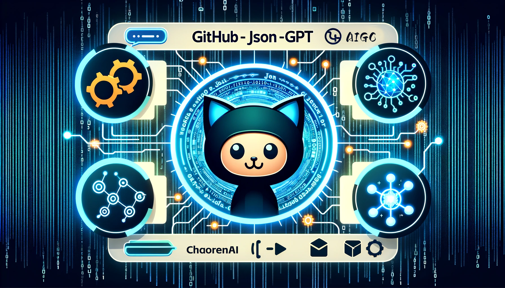

# GitHub JSON Toolkit for LLM(chatGPT) Training Data

## Overview
The GitHub JSON Toolkit for LLM Training Data is an open-source project aimed at simplifying operations on JSON files, especially focusing on the needs around Large Language Models (LLM) like ChatGPT. This toolkit is equipped with scripts for analyzing, comparing, merging, and converting JSON files — essential tasks for preparing and processing training datasets for LLMs.

## Features
- **Analyze JSON**: Quickly inspect JSON files to summarize their content, size, and structure, making it easier to assess training data quality.
- **Compare JSON**: Efficiently identify differences between two JSON files in content and size, useful for tracking dataset changes or inconsistencies.
- **Merge JSON**: Seamlessly combine multiple JSON files into a single comprehensive file, aiding in the consolidation of training data.
- **Batch to JSON**: Convert batch files of various formats (CSV, DOC, PDF, etc.) into JSON format, facilitating the integration of diverse data sources.
- **Code to JSON**: Extract and save code snippets from projects in a structured JSON format, streamlining the preparation of code-based datasets for LLM training.

## How to Use
1. Clone this repository to your local machine.
2. Ensure Python is installed on your system.
3. Navigate to the project directory and execute a script according to your requirements. For instance, to analyze a JSON file for LLM training data:

   ```bash
   python AnalyzeLargeJson.py
   ```

4. Adhere to any script-specific instructions or input requirements.

## Contribution
Contributions to the GitHub JSON Toolkit for LLM Training Data are welcome. Feel free to fork the repository, make improvements, and submit pull requests to enhance the toolkit's capabilities for LLM data preparation.
